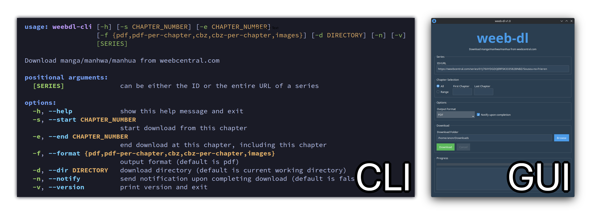

## Overview

A tool to download manga/manhwa/manhua from [weebcentral.com](https://weebcentral.com) (use an adblocker).



## Features

- Download series with a command-line or graphical user interface
- Download series as PDF, CBZ or simply as raw images
- Produce PDF or CBZ files on a per-chapter basis
- Select a range of chapters to download

## Installation

To install `weeb-dl` in an isolated environment, Python tools such as [uv](https://docs.astral.sh/uv) or [pipx](https://pipx.pypa.io/stable) can be used.

```bash
uv tool install weeb-dl # install with uv

# alternative
pipx install weeb-dl # install with pipx
```

## Usage

To use `weeb-dl` after installation, simply start the CLI or GUI.

```bash
weebdl-cli # command-line interface

weebdl-gui # graphical user interface
```

## Development

`weeb-dl` is developed with [uv](https://docs.astral.sh/uv).

```bash
git clone 'https://github.com/tristan-harris/weeb-dl.git'

uv sync # update project's environment

uv run weebdl-cli # run weeb-dl via CLI
uv run weebdl-gui # run weeb-dl via GUI
```
